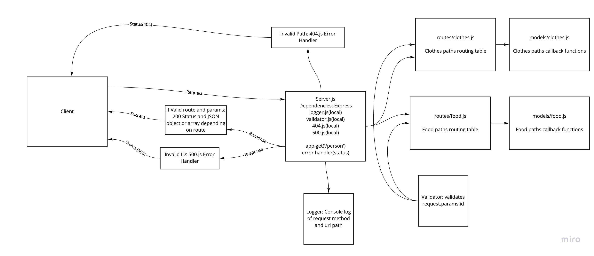

# basic-api-server

## Github PR
* https://github.com/gerstej9/basic-express-server/pull/1

## Github Actions
* No .yml or instruction on specific workflow test provided

## Heroku URLs
* URL: https://jamesgers-basic-express-server.herokuapp.com
* Test: https://jamesgers-basic-express-server.herokuapp.com/person?name=James

## UML

## Class notes
* Learn how to utilize routing folders/files and import them into src/server.js
* Learn how to utilize model folders/files for route callback functions and import them into respective routing files
* Learn how to use CRUD
* Learn how to test CRUD and REST functionality with Jest
